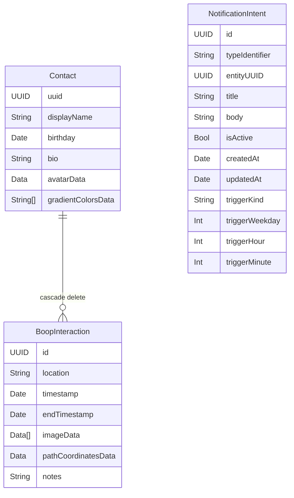

# Data Model

`NotificationIntent` is standalone with no SwiftData relationships.
`NotificationIntent.entityUUID` is a loose UUID reference to a `Contact` (not a SwiftData `@Relationship`), used for contact reminder notifications.
